<picture>
  <source media="(prefers-color-scheme: dark)" srcset="assets/living-system-dark.svg">
  <source media="(prefers-color-scheme: light)" srcset="assets/living-system-light.svg">
  
</picture>

<div align="center">

**[ OPEN SYSTEM ↗ ](https://001zk.github.io/001zk/)**

</div>

---

## SYSTEM

`001ZK // LIVING SYSTEM` representa como componentes de rede, infraestrutura, automação, software e pesquisa se conectam no meu trabalho — não como uma timeline, mas como uma arquitetura.

```text
NETWORK ── INFRASTRUCTURE ── AUTOMATION ── SOFTWARE ── RESEARCH
```

---

## EXPERIENCE

**CURRENT NODE**
Minsait / Indra Company — Analista de Suporte de TI Jr

**PREVIOUS NODE**
Arroba Banda Larga — Analista de NOC / TI Interno
`GPON` `EPON` `OLT` `ONU` `Zabbix` `IXC` `Proxmox` `VPN` · N2/N3 support, network troubleshooting, corporate IT infrastructure.

---

## ENGINEERING

| Module | Focus |
|---|---|
| `NODE/NET` — Network | GPON, EPON, OLT, ONU, VPN |
| `NODE/INF` — Infrastructure | NOC, Zabbix, Proxmox, Linux, IXC |
| `NODE/AUT` — Automation | Python, Node.js, Google Apps Script, APIs |
| `NODE/SWE` — Software | JavaScript, Git, GitHub, System Design |

**Education**
Engenharia de Software — Estácio de Sá (cursando)
Técnico em Informática — concluído

---

## RESEARCH

**R-01 / RESEARCH NODE — REUSABLE COMPUTING**
*[Manual de Montagem de um Computador Reciclável Utilizando Peças Reaproveitadas](https://zenodo.org/records/18135901)*
`HARDWARE` `REUSE` `SUSTAINABILITY` · publicado no Zenodo

---

## CERTIFICATIONS

**C-01** — OCNA Wireless — TP-Link
**C-02** — Ignite Brasil — Empreendedorismo — Wadhwani Foundation

---

## PROJECTS

Configurados em [`data/projects.json`](data/projects.json) — atualizados sem tocar no README.

---

## TECHNOLOGY

`Python` `Node.js` `JavaScript` `Google Apps Script` `Linux` `Git` `GitHub`

---

## CONTACT

GitHub: [@001zk](https://github.com/001zk) · [@Luiz-alt001](https://github.com/Luiz-alt001)
LinkedIn: [Luiz Gustavo de Barros](https://www.linkedin.com/in/luiz-gustavo-de-barros/)
Portfolio: [portfolio-luizs-projects-9a2b01d1.vercel.app](https://portfolio-luizs-projects-9a2b01d1.vercel.app/)

---

<sub>SYSTEM REV. 2026.08 · BUILD 001ZK — gerado a partir de <a href="data/profile.json">data/profile.json</a> via <a href="scripts/generate_system.py">scripts/generate_system.py</a>. Nenhuma métrica é inventada: campos sem dado real exibem <code>N/A</code>.</sub>

---

<details>
<summary><sub>Setup do GitHub Pages (OPEN SYSTEM)</sub></summary>

O `index.html` já está pronto na raiz do repositório, mas o GitHub Pages
precisa ser habilitado manualmente uma vez:

1. No repositório, vá em **Settings → Pages**
2. Em **Source**, selecione **Deploy from a branch**
3. Branch: **main**, pasta: **/ (root)** → **Save**
4. Aguarde 1–2 minutos e acesse `https://001zk.github.io`

Sempre que `data/profile.json`, `data/projects.json` ou `data/links.json`
mudarem, rode (ou deixe o Actions rodar):

```bash
python3 scripts/generate_system.py
python3 scripts/generate_web.py
```

</details>
